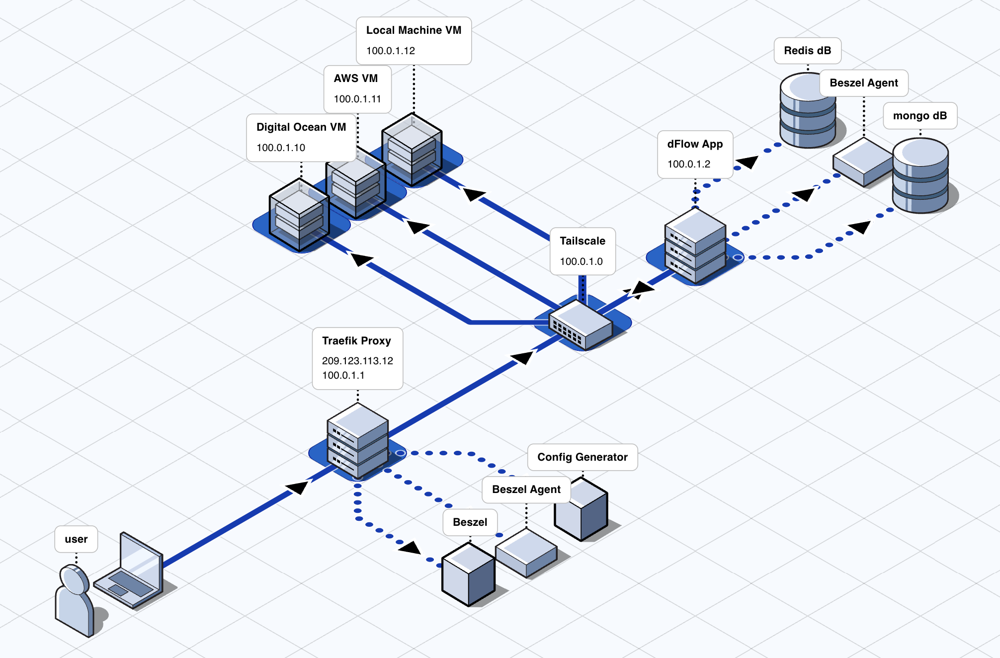

<p align="center">
<picture>
  <source media="(prefers-color-scheme: dark)" srcset="apps/web/public/images/dflow-logo-wordmark-light.svg">
  <source media="(prefers-color-scheme: light)" srcset="apps/web/public/images/dflow-logo-wordmark-dark.svg">
  
</picture>
</p>

<h3 align="center">Open-source alternative to Railway, Vercel and Heroku</h3>

<p align="center">
Host and Scale Apps, Databases & Storage in your own cloud.<br/>
Automated deployment workflows, container orchestration, and infrastructure management tools,<br/>
all within your private network.
</p>

<p align="center">
  <a href="https://dflow.sh/sign-up?source=github"><strong>Cloud</strong></a> ·
  <a href="https://dflow.sh/try-demo"><strong>Try Demo</strong></a> ·
  <a href="https://dflow.sh/docs"><strong>Documentation</strong></a> ·
  <a href="https://discord.gg/5w7JUQYaAD"><strong>Discord</strong></a>
</p>

<p align="center">
  <a href="https://github.com/dflow-sh/dflow/stargazers"></a>
  <a href="https://github.com/dflow-sh/dflow/blob/main/license.md"></a>
  <a href="https://discord.gg/5w7JUQYaAD"></a>
  <a href="https://github.com/dflow-sh/dflow"></a>
</p>

<br/>

<a href="https://dflow.sh">
  
</a>

<br/>
<br/>

## ✨ Features

- 🚀 **Deploy Anything** - Git repos, Docker images, and databases (Postgres, MongoDB, MySQL, MariaDB, Redis)
- ☁️ **Multi-Cloud Support** - Works on AWS, GCP, Azure, DigitalOcean, Hetzner, or your own hardware
- 🔒 **Private Networking** - Zero-trust security with Tailscale end-to-end encryption (no SSH keys needed)
- 👥 **RBAC** - Unlimited custom roles and permissions for admins and users
- 📦 **Templates** - Pre-configured templates for popular open-source projects
- 🎨 **White Labeling** - Full customization with your branding and domains

**[See more on our website →](https://dflow.sh)**

<br/>

## 🎥 Introducing dFlow

<p align="center">
  <a href="https://www.youtube.com/watch?v=tvMEokVR-DE">
    
  </a>
</p>

<p align="center">
  <strong>Modern Opensource PAAS, alternative to Vercel, Railway, Heroku</strong><br/>
  <em>Learn about dFlow's features and how it simplifies deployment</em>
</p>

> 💡 **Tip:** Visit our [YouTube channel](https://www.youtube.com/@paas-dflow-sh) for tutorials and updates!

<br/>

## 🚀 Quick Start

### Self-Hosted Installation

Get your own dFlow instance running in minutes with our automated setup script:

```bash
# Run as root user
sudo curl -fsSL https://get.dflow.sh | bash
```

The script will guide you through:
- ✅ Tailscale configuration
- ✅ Email setup for SSL certificates
- ✅ Domain configuration
- ✅ JWT secret generation
- ✅ Docker Compose setup

**Requirements:**

| Component         | Recommended  | Minimum |
| ----------------- | ------------ | ------- |
| Ubuntu            | 24.04, 22.04 | LTS     |
| CPU               | 2 vCPU       | 1 vCPU  |
| RAM               | 8 GB         | 2 GB    |
| Docker            | Latest       | 20.10+  |
| Tailscale Account | Free tier    | Free    |
| Domain (optional) | Custom       | nip.io  |

<br/>

## 🏗️ Development

This project is organized as a **Turborepo monorepo** for better code organization and build performance.

### Prerequisites

- **Node.js**: v18.20.2 or >=20.9.0
- **pnpm**: 10.24.0

### Installation

```bash
# Clone the repository
git clone https://github.com/dflow-sh/dflow.git
cd dflow

# Install dependencies
pnpm install

# Set up environment variables
ln -s ../../.env apps/web/.env
# Edit .env with your configuration

# Start development server
pnpm dev
```

The application will be available at `http://localhost:3000`.

### Building

```bash
# Build all packages
pnpm build

# Build for production with Docker
docker build -t dflow:latest .

# Or use the optimized build
docker build -f Dockerfile.turbo -t dflow:latest .
```

**📚 For detailed development instructions, see [MONOREPO.md](./MONOREPO.md)**

<br/>

## 📖 Documentation

- **[Monorepo Guide](./MONOREPO.md)** - Development setup, package management, and workflows
- **[Docker Guide](./DOCKER.md)** - Docker build and deployment instructions
- **[Official Docs](https://dflow.sh/docs)** - Complete product documentation

<br/>

## 🤝 Contributing

We welcome contributions! Please read our [Contributing Guide](./CONTRIBUTING.md) before submitting a Pull Request.

### Development Workflow

```bash
# Create a feature branch
git checkout -b feature/your-feature

# Make changes and test
pnpm dev
pnpm build

# Commit and push
git add .
git commit -m "feat: your feature description"
git push origin feature/your-feature
```

<br/>

## 💬 Community & Support

Join our growing community and get help from the team:

<table>
  <tr>
    <td align="center">
      <a href="https://discord.gg/5w7JUQYaAD">
        
      </a>
    </td>
    <td align="center">
      <a href="https://twitter.com/dflow_sh">
        
      </a>
    </td>
    <td align="center">
      <a href="https://www.youtube.com/@paas-dflow-sh">
        
      </a>
    </td>
  </tr>
  <tr>
    <td align="center">
      <a href="https://www.linkedin.com/company/dflow-sh">
        
      </a>
    </td>
    <td align="center">
      <a href="https://peerlist.io/dflow">
        
      </a>
    </td>
    <td align="center">
      <a href="https://github.com/dflow-sh/dflow/issues">
        
      </a>
    </td>
  </tr>
</table>

### Discord Community

<a href="https://discord.gg/5w7JUQYaAD">
  
</a>

### Resources

- 📚 **[Documentation](https://dflow.sh/docs)** - Official guides and API reference
- 🐛 **[GitHub Issues](https://github.com/dflow-sh/dflow/issues)** - Bug reports and feature requests
- 💡 **[Discussions](https://github.com/dflow-sh/dflow/discussions)** - Community Q&A and ideas

<br/>

## 🎯 Try Live Demo

Experience dFlow without installation: **[Try Demo →](https://dflow.sh/try-demo)**

<br/>

## 🗺️ Roadmap

Check out our [public roadmap](https://dflow.sh/roadmap) to see what we're working on next!

<br/>

## 📄 License

dFlow is licensed under the [MIT License](./license.md).

<br/>

## 🌟 Contributors

Thanks to all who have contributed to dFlow!

<a href="https://github.com/dflow-sh/dflow/graphs/contributors">
  
</a>

<br/>
<br/>

## ⭐ Star History

<a href="https://star-history.com/#dflow-sh/dflow&Date">
  <picture>
    <source media="(prefers-color-scheme: dark)" srcset="https://api.star-history.com/svg?repos=dflow-sh/dflow&type=Date&theme=dark" />
    <source media="(prefers-color-scheme: light)" srcset="https://api.star-history.com/svg?repos=dflow-sh/dflow&type=Date" />
    
  </picture>
</a>

<br/>
<br/>

---

<p align="center">
  Made with ❤️ by the dFlow team
</p>

<p align="center">
  <a href="https://dflow.sh">Website</a> •
  <a href="https://dflow.sh/docs">Docs</a> •
  <a href="https://discord.gg/5w7JUQYaAD">Discord</a> •
  <a href="https://twitter.com/dflow_sh">Twitter</a>
</p>
