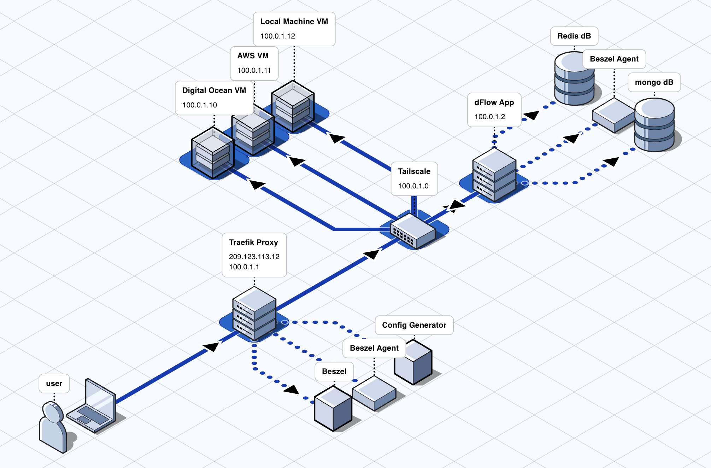

<p align="center">
<picture>
  <source media="(prefers-color-scheme: dark)" srcset="public/images/dflow-logo-wordmark-light.svg">
  <source media="(prefers-color-scheme: light)" srcset="public/images/dflow-logo-wordmark-dark.svg">
  
</picture>
</p>

<h3 align="center" style="text-wrap: balance;">dFlow is a platform for deploying, managing, and scaling git apps, Docker images, and databases on your own infrastructure.</h3>


> ⚠️ **Self-host artifacts only.** This repository publishes Docker Compose, Dockerfiles, and the `get.dflow.sh` installer. It is not the dFlow Cloud source, and Cloud does not ship from this repo. Platform source is not open source. For the hosted product, see [dflow.sh](https://dflow.sh).

<br/>
<br/>

<a href="https://dflow.sh">
    
</a>

<br/>
<br/>

## Features

- **Deploy Anything**: Deploy any Public/Private Git repository, Docker image
  and Databases (Postgres, MongoDB, MySQL, MariaDB, Redis).
- **Works on your infrastructure**: Run dFlow on AWS, Azure, Hetzner, or your
  own machine.
- **Private Networking**: Zero trust support using Tailscale end-to-end
  encryption. No SSH-Keys required.
- **Role Based Access Control**: Create an unlimited number of custom roles and
  permissions for admin and end users.
- **Templates**: Kick start your deployments with ready made popular templates
- **White Labeling**: Full customization with your branding, domains, and more.

**[See more on our website](https://dflow.sh)**.

<br/>

## Self-Hosting Guide

This repository is the public install path for a self-hosted dFlow instance.

**Requirements**

Make sure you have the following:

| OS/Tools          | Recommended  | Minimum |
| ----------------- | ------------ | ------- |
| Ubuntu            | 24.04, 22.04 | LTS     |
| CPU               | 2vCPU        | 1vCPU   |
| RAM               | 8GB          | 2GB     |
| Docker            | N/A.         | N/A.    |
| Tailscale Account | N/A.         | N/A.    |
| Domain            | N/A.         | N/A.    |

<br/>

## Installation

Run the following command to begin setup. It will guide you through configuring
everything needed for your dFlow instance:

```bash
# run command as root user
sudo curl -fsSL https://get.dflow.sh | bash
```

Follow our [Installation Guide](./INSTALLATION_GUIDE.md) for more details

<br/>

## Contributing

This repository accepts contributions to self-host install artifacts
(Dockerfiles, Compose, installer docs). It is not the dFlow Cloud or platform
source. Please read our [Contributing Guide](./CONTRIBUTING.md) before opening a
pull request.

<br/>

## Community support

For general help using dFlow, please refer to
[the official dFlow documentation](https://dflow.sh/docs). For additional help,
you can use one of these channels to ask a question:

- [Discord](https://discord.gg/5w7JUQYaAD) (For live discussion with the
  Community and dFlow team)
- [GitHub](https://github.com/dflow-sh/dflow) (Bug reports for this install repo)
- [X](https://x.com/dflow_sh) (Get the news fast)
- [YouTube Channel](https://www.youtube.com/@paas-dflow-sh) (Learn from Video
  Tutorials)

<br/>


## License

The MIT license in [license.md](./license.md) applies only to this public
self-host / install repository. It does not license dFlow Cloud or the private
platform source.

<br/>

## 🤝 Contributors

Thanks to all who have contributed to this repository.

<a href="https://github.com/dflow-sh/dflow/graphs/contributors">
  
</a>
